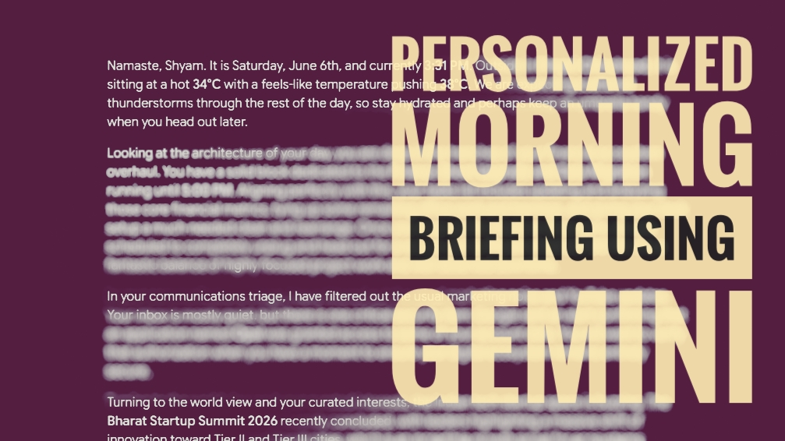

# Life with Technology 🤖🌱

A repository dedicated to mindful, highly personalized, and responsible AI & Technology system architectures to excel your daily life.

## About
As technology & AI becomes more integrated into our lives, the potential of what digital systems can do and to what extent they can provide value to our lives is increasing exponentially, much faster than we realize. This repository explores utiilty systems and procedures I explored and built, which can assist us to get the best of evolving technologies in our day-to-day lives.

## Current Sub-Projects

1. **Personalized Morning Brief using Google Gemini** A step-by-step guide to utilize Google Gemini (Advanced Tier) to get highly personalized morning briefs referencing your emails, calendar and tasks, and personal life goals.

```
Note: Additional irrelevant components of this repository will be soon moved to my personal portfolio's Blog section, and this repository's name will be refactored to best present the new intent of this repository.
```
